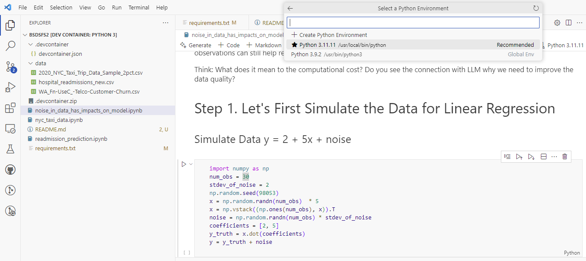

# Instructions

To run this lab:

- Open the repository in VSCode on a machine that has docker installed
- Open VSCode should prompt you to re-open it in the Dev Container.  Do so.
- If not prompted to open in the Dev Container, in VSCode, press `Ctrl-Shift-P` (for Windows, not sure on mac), and type "**Dev Containers: Reopen in Container**"
- Follow the [Sentiment140 Exercise.docx](./Sentiment140%20Exercise.docx) instructions to download the data set.
  - You need to extract the zip file that contains the data set (./sentiment140)
- Open one of the notebooks, and when you attempt to run a cell, from `Python Environments`, choose the `Python 3.11.11` kernel in `/usr/local/bin/python`:

  
